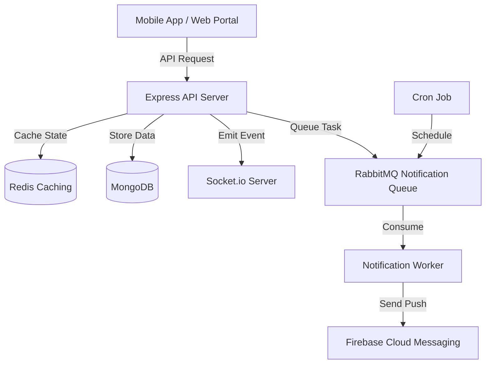

# Qflow - Healthcare Token & Queue Management System

Qflow is a full-stack healthcare solution designed to optimize hospital queue management. It enables patients to track their token status in real-time, reducing waiting area congestion and improving the overall patient experience.

## 🚀 Key Features

- **Live Token Tracking**: Real-time updates via **Socket.io** so patients can monitor their position in the queue from anywhere.
- **Event-Driven Reminders**: Automated appointment reminders powered by **RabbitMQ** and **Node-Cron**.
- **Asynchronous Notifications**: Instant push notifications via **Firebase (FCM)** processed through a background worker to ensure API responsiveness.
- **Smart Queue Logic**: Redis-backed state management for high-performance, low-latency token updates.
- **Secure Authentication**: Robust JWT-based authentication with role-based access for Hospitals and Patients.

## 🛠️ Tech Stack

- **Backend**: Node.js, Express.js
- **Database**: MongoDB (Mongoose)
- **Messaging**: RabbitMQ (amqplib)
- **Caching**: Redis
- **Real-time**: Socket.io
- **Cloud/Infra**: AWS (S3 for media, EC2 for hosting), Docker
- **Automation**: GitHub Actions (CI/CD)

## 🏗️ Architecture



## ⚙️ Setup & Installation

1. **Clone the repository**
   ```bash
   git clone <repository-url>
   cd qflow-backend
   ```

2. **Install dependencies**
   ```bash
   npm install
   ```

3. **Environment Configuration**
   Create a `.env` file in the root directory and add:
   ```env
   PORT=8000
   MONGO_DB_URL=your_mongodb_url
   REDIS_HOST=your_redis_host
   REDIS_PORT=your_redis_port
   RABBITMQ_URL=amqp://localhost
   FIREBASE_SERVICE_ACCOUNT=path_to_json
   ```

4. **Run the application**
   ```bash
   # Development mode
   npm run dev

   # Production mode
   npm start
   ```

## 🐳 Docker Deployment

The project is fully containerized. To run using Docker:
```bash
docker-compose up --build
```

---
Built with ❤️ by [Nidhin V Ninan](https://github.com/nidhin29)
